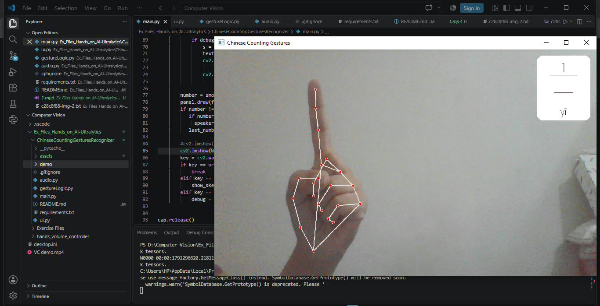
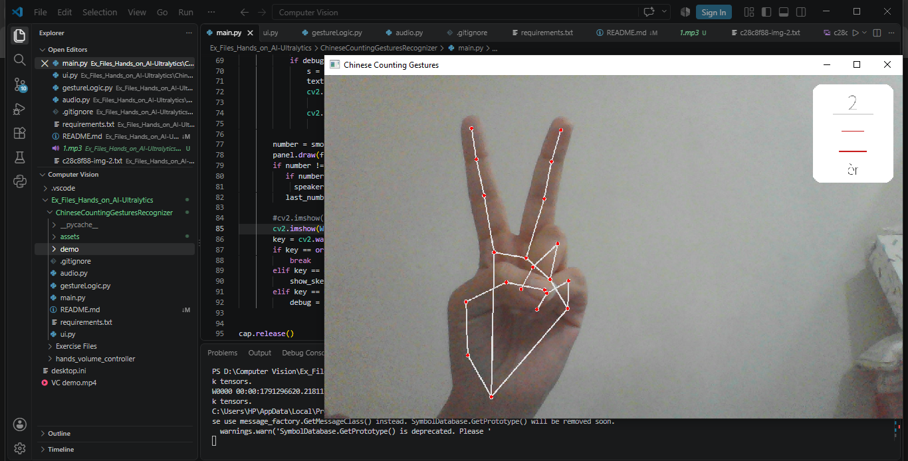
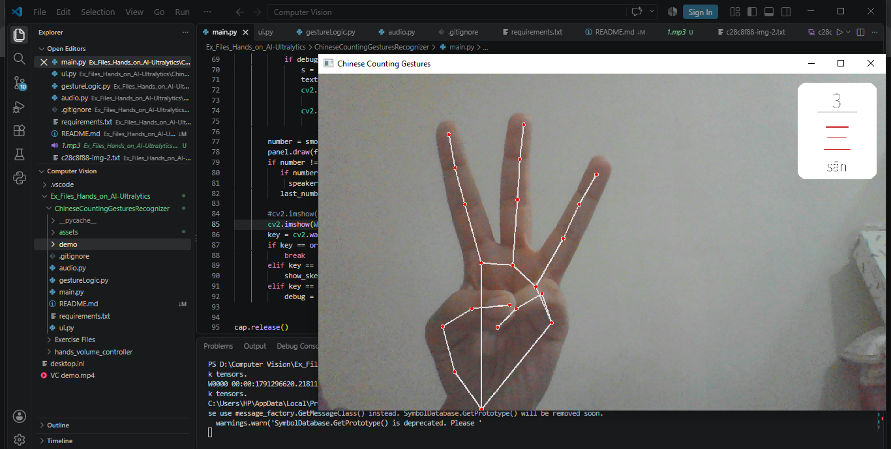
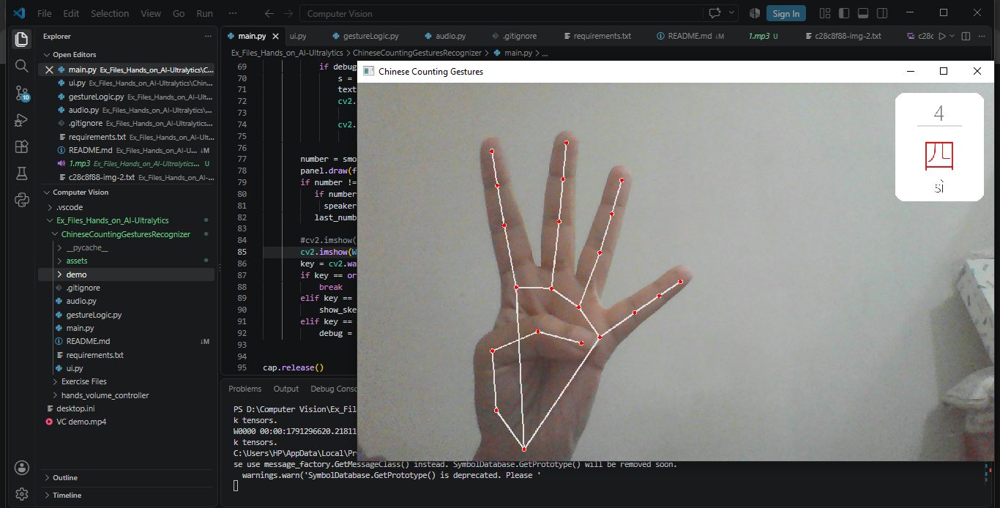
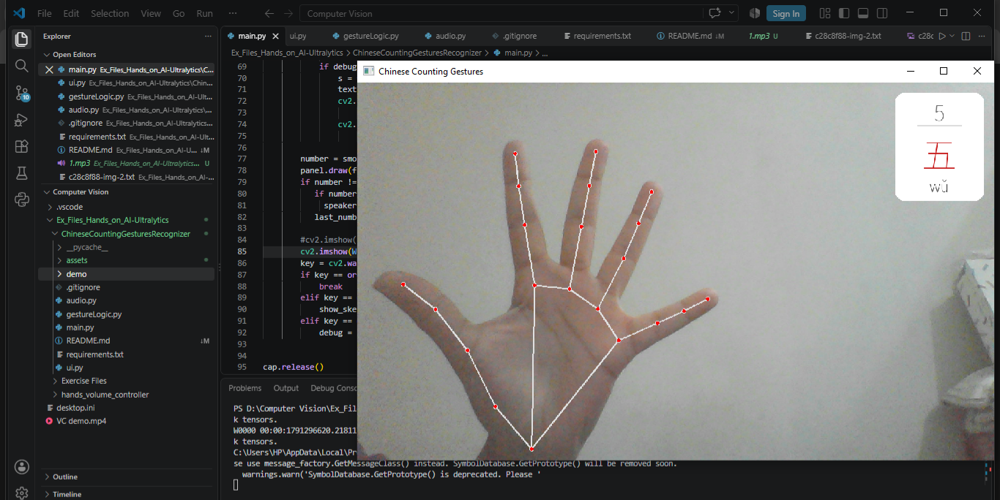
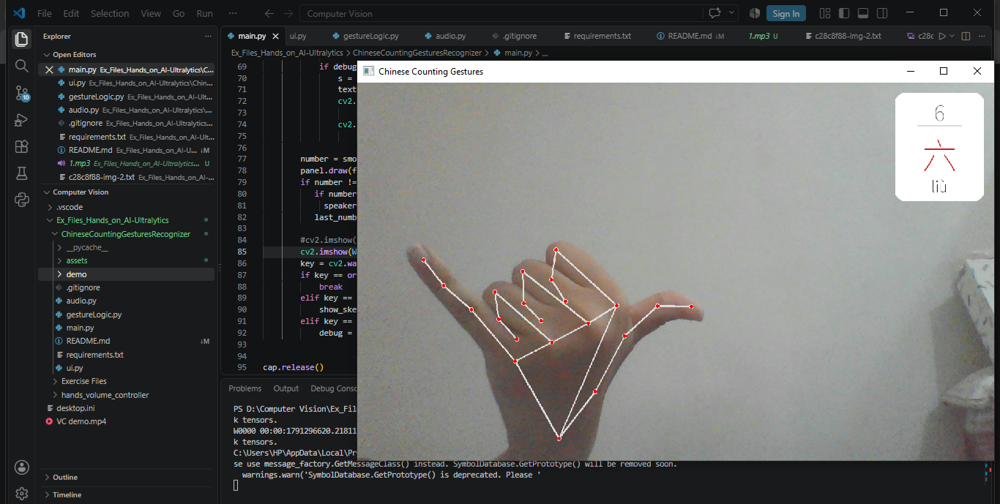
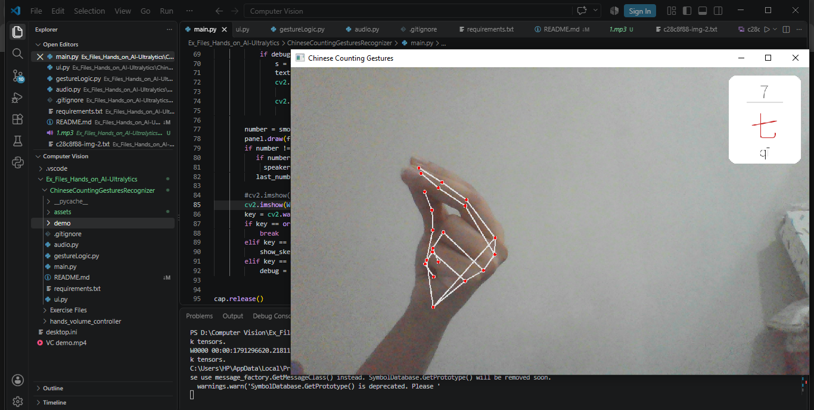
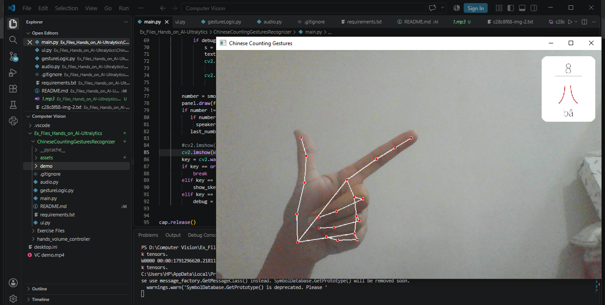
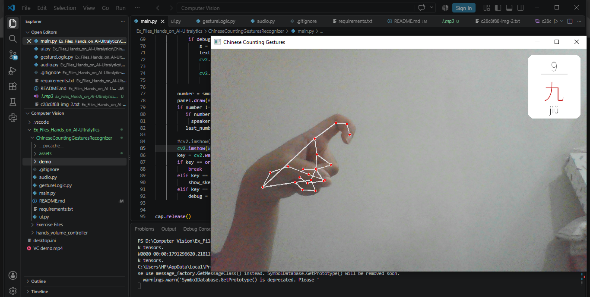
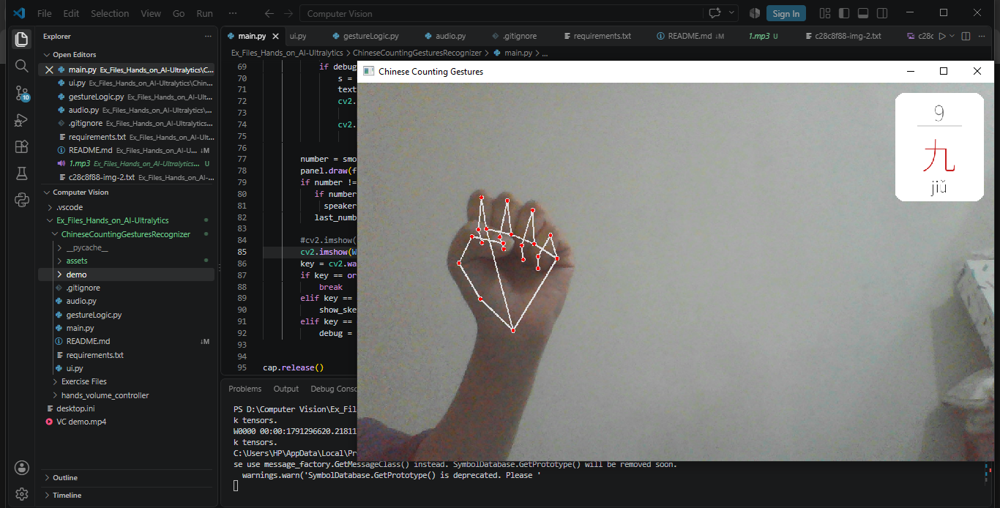

# 🤟 Chinese Counting Gesture Recognizer

Real-time hand gesture recognition that reads **Chinese single-hand number gestures (1–10)** from your webcam, shows the number with its **Chinese character and pinyin**, and **speaks it out loud**.

Built with Python, OpenCV and MediaPipe as a hands-on computer vision learning project.

<p align="center">
  
</p>

## ✨ Features

- Detects one hand in real time and tracks 21 landmarks per frame
- Recognises Chinese number gestures **1 to 10** with a single hand
- Compact white info card (top-right) showing the **number, Chinese character and pinyin**, so your face and gesture stay fully visible
- **Spoken pronunciation** of each number (Mandarin), played only when the number changes
- **Smoothing buffer** to stop the output flickering between frames
- Works for **left or right hand**
- Debug mode to see finger states live and tune the gestures

## 🖐️ Gesture chart

| Number | 汉字 | Pinyin | Gesture |
|:---:|:---:|:---:|---|
| 1 | 一 | yī | Index finger up |
| 2 | 二 | èr | Index + middle finger up |
| 3 | 三 | sān | Index + middle + ring finger up |
| 4 | 四 | sì | Four fingers up, thumb tucked |
| 5 | 五 | wǔ | Open palm |
| 6 | 六 | liù | Thumb + pinky out ("hang loose") |
| 7 | 七 | qī | Thumb, index and middle fingertips pinched together |
| 8 | 八 | bā | Thumb + index out (L shape) |
| 9 | 九 | jiǔ | Index finger bent like a hook |
| 10 | 十 | shí | Closed fist |


### Gesture photos

| 1 | 2 | 3 | 4 | 5 |
|:---:|:---:|:---:|:---:|:---:|
|  |  |  |  |  |

| 6 | 7 | 8 | 9 | 10 |
|:---:|:---:|:---:|:---:|:---:|
|  |  |  |  |  |

## 🧠 How it works

1. **Capture**: OpenCV reads webcam frames and mirrors them.
2. **Landmarks**: MediaPipe Hands returns 21 (x, y, z) points for the hand.
3. **Finger states**: a finger counts as *extended* when its tip is farther from the wrist than its middle joint. Using distances instead of raw y-coordinates keeps it working when the hand is tilted. The thumb is checked against the pinky knuckle because it moves sideways.
4. **Gesture mapping**: the on/off pattern of the five fingers is matched to a number. Gestures 7 and 9 use extra rules: fingertip-to-fingertip distance for the pinch (7) and the length of the first finger segment for the hook (9). All distances are divided by palm size so it works at any distance from the camera.
5. **Smoothing**: a number is only accepted once it wins most of the last 8 frames.
6. **Display**: the info card is rendered once per number with Pillow (OpenCV can't draw Chinese text), cached, and pasted onto the frame.
7. **Audio**: Mandarin audio is generated once with gTTS, cached as mp3 files, and played with pygame without blocking the video loop.

## 🛠️ Tech stack

| Purpose | Library |
|---|---|
| Video capture and drawing | `opencv-python` |
| Hand landmark detection | `mediapipe` (0.10.14) |
| Chinese text rendering | `Pillow` + Noto Sans SC font |
| Text-to-speech | `gTTS` |
| Audio playback | `pygame` |

## 📁 Project structure

```
ChineseCountingGestureRecognizer/
├── main.py             # main loop: webcam, detection, display, audio trigger
├── gesture_logic.py    # finger states, number classification, smoothing
├── ui.py               # small white info card (number, 汉字, pinyin)
├── audio.py            # generates, caches and plays number sounds
├── assets/
│   ├── fonts/          # Noto Sans SC font (.ttf)
│   └── audio/          # cached mp3s (1.mp3 ... 10.mp3)
├── demo/               # demo GIF and gesture photos
├── requirements.txt
└── README.md
```

## 🚀 Getting started

**Requirements:** Python 3.9 to 3.12, a webcam, and internet for the first run (to generate the audio files).

```bash
# 1. Clone
git clone https://github.com/AmaraTalib/chinese-counting-gesture-recognizer
cd chinese-counting-gesture-recognizer

# 2. (Optional) create a virtual environment
python -m venv venv
venv\Scripts\activate        # Windows
# source venv/bin/activate   # macOS / Linux

# 3. Install dependencies
python -m pip install -r requirements.txt

# 4. Run
python main.py
```

Make sure a Noto Sans SC `.ttf` file is in `assets/fonts/` (download it free from [Google Fonts](https://fonts.google.com/noto/specimen/Noto+Sans+SC)).

### Controls

| Key | Action |
|:---:|---|
| `q` | Quit |
| `l` | Show / hide hand skeleton |
| `d` | Show / hide debug info (finger states, raw detection) |

## 🎛️ Tuning

If a gesture is unreliable on your setup, adjust the constants at the top of `gesture_logic.py`:

| Constant | Affects | Tip |
|---|---|---|
| `THUMB_OUT_RATIO` | Thumb detection (6, 8) | Raise it if the thumb counts as out when it isn't |
| `PINCH_RATIO` | Gesture 7 | Raise it if 7 never triggers |
| `HOOK_MIN_SEGMENT` | Gesture 9 | Press `d` and compare the `hook` value for a fist vs a hook, then pick a value in between |

## 📚 What I learned

- Working with MediaPipe hand landmarks and building rule-based gesture recognition
- Why distance-based features are more robust than coordinate comparisons
- Normalising by hand size so detection is independent of camera distance
- Smoothing noisy per-frame predictions with a voting buffer
- Rendering Unicode text on OpenCV frames with Pillow
- Caching and non-blocking audio so the video loop never freezes

## 🔮 Future improvements

- Two-hand support for numbers above 10
- Train a small classifier on landmark data instead of hand-written rules
- A practice mode that asks for a number and checks your gesture
- Support for other counting systems (ASL, Japanese, Korean)
- Offline text-to-speech option

## 🙌 Acknowledgements

- [MediaPipe](https://developers.google.com/mediapipe) by Google for hand tracking
- [Noto Sans SC](https://fonts.google.com/noto/specimen/Noto+Sans+SC) font (SIL Open Font License)

## 👤 Author

**Amara Talib**
[LinkedIn](https://www.linkedin.com/in/amara-talib) · [GitHub](https://github.com/AmaraTalib)

⭐ on the repo is appreciated! 
